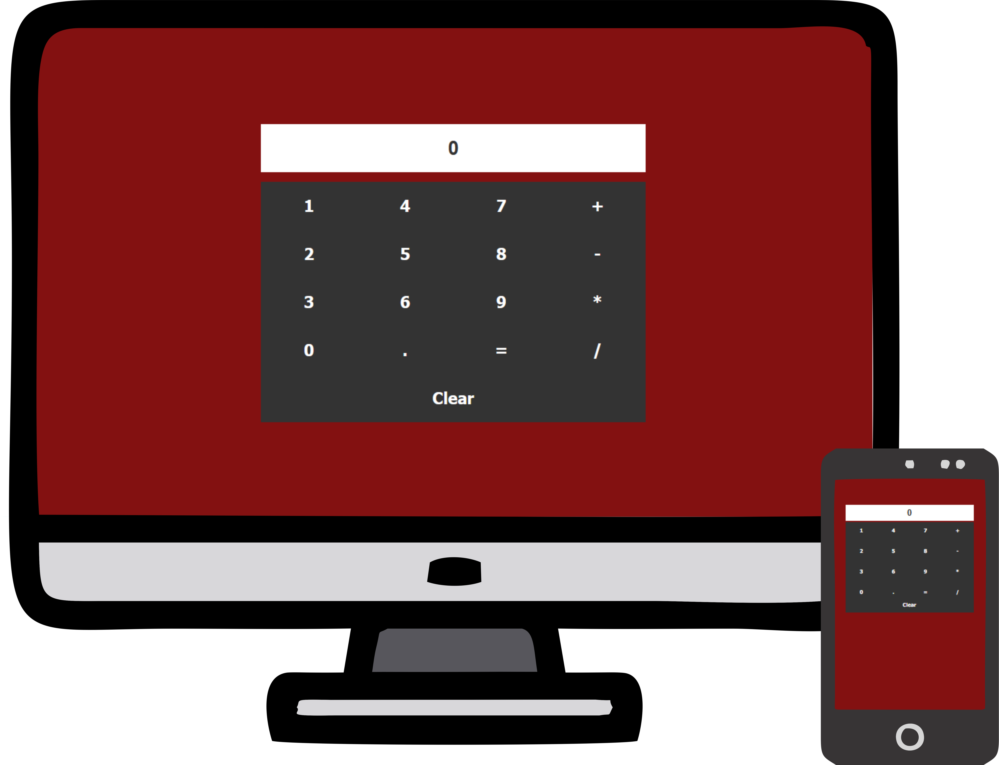

# Calculadora Simples em JavaScript

Este é um projeto de uma calculadora básica desenvolvida com HTML, CSS e JavaScript. O código foi escrito com foco em clareza e organização, mesmo sendo um projeto para iniciantes em JavaScript.

## Demonstração

  

## Funcionalidades

- Operações básicas: soma, subtração, multiplicação e divisão.

- Interface limpa e responsiva.

- Uso de funções para modularizar o código e facilitar a manutenção.
